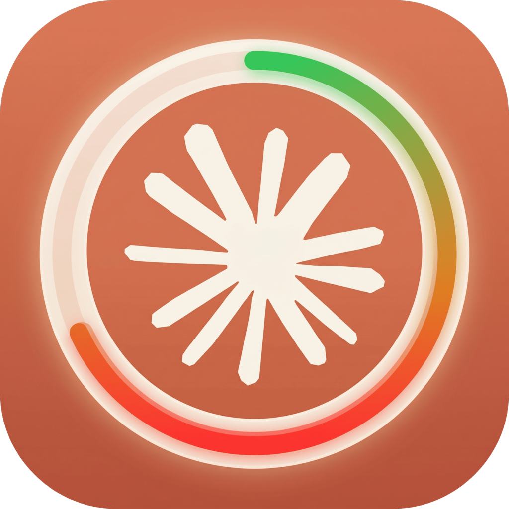
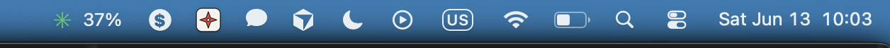
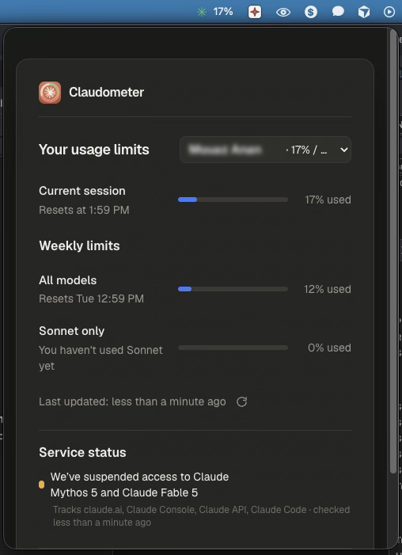

<p align="center">
  
</p>

<h1 align="center">Claudometer</h1>

<p align="center">
  Your Claude usage limits, live in the macOS menu bar —
  <br/>shown <b>exactly the way Claude shows them</b>.
</p>

<p align="center">
  
</p>
<p align="center">
  
</p>

## Why Claudometer?

- **Familiar by design.** It mirrors Claude's own *Settings → Usage* screen — the same session / weekly / per-model bars you already know. Nothing new to learn.
- **At a glance.** A color-coded **% sits right in your menu bar** (green → amber → red as you approach the cap) so you stay mindful without clicking.
- **Service status built in.** Live **Claude service status** pulled straight from [status.claude.com](https://status.claude.com) — incidents and degraded components included.
- **Private.** Your session cookie stays on your machine. There's no backend, no account, no telemetry.

## Install

1. From [Releases](../../releases), download the DMG for your Mac — `…-arm64.dmg` for **Apple Silicon** (M-series) or `…-x64.dmg` for **Intel**. *(Apple menu → About This Mac to check.)*
2. Open the DMG and drag **Claudometer** to **/Applications**, then launch it. It lives in your menu bar (no dock icon).
3. Click the menu-bar icon → follow the one-time setup to paste your claude.ai cookie. The app guides you with live ✓/✗ checks so you know you copied the right thing.

> **Unsigned build.** macOS blocks the first launch (*"Apple could not verify…"*). To open it, either:
> - go to **System Settings → Privacy & Security**, then click **"Open Anyway"** (it appears right after you try to open the app), then reopen it — **or**
> - run once in Terminal: `xattr -dr com.apple.quarantine "/Applications/Claudometer.app"`
>
> *(On macOS 14 and earlier you could right-click → Open; that no longer works on macOS 15+.)*

## How it works

Claudometer reads the **same usage API the Claude website uses**, authenticated with your own `claude.ai` session cookie. A tiny local server relays the request (the browser can't send the cookie cross-origin) and adds your browser's User-Agent so Cloudflare's `cf_clearance` validates. The cookie is stored only in the app and sent **directly to claude.ai** — never to any third party.

```
your cookie ─▶ local relay ─▶ claude.ai /api/organizations/{org}/usage   (session / weekly / per-model)
                           └▶ status.claude.com                          (service status)
```

## Build from source

```bash
npm install
npm run dev      # preview in a browser at http://localhost:3000
npm run dist     # build Claudometer.app (host arch) into ./release
npm run release  # build arm64 + x64 DMGs and publish a GitHub release (maintainers)
```

Built with Next.js + Electron.

## Privacy

The only credential is your `claude.ai` cookie. It's kept in the app's local storage, sent only to `claude.ai` to read your usage, and never persisted on a server. The code is open — verify it yourself.

---

<sub>Not affiliated with or endorsed by Anthropic. "Claude" is a trademark of Anthropic. · MIT License</sub>
