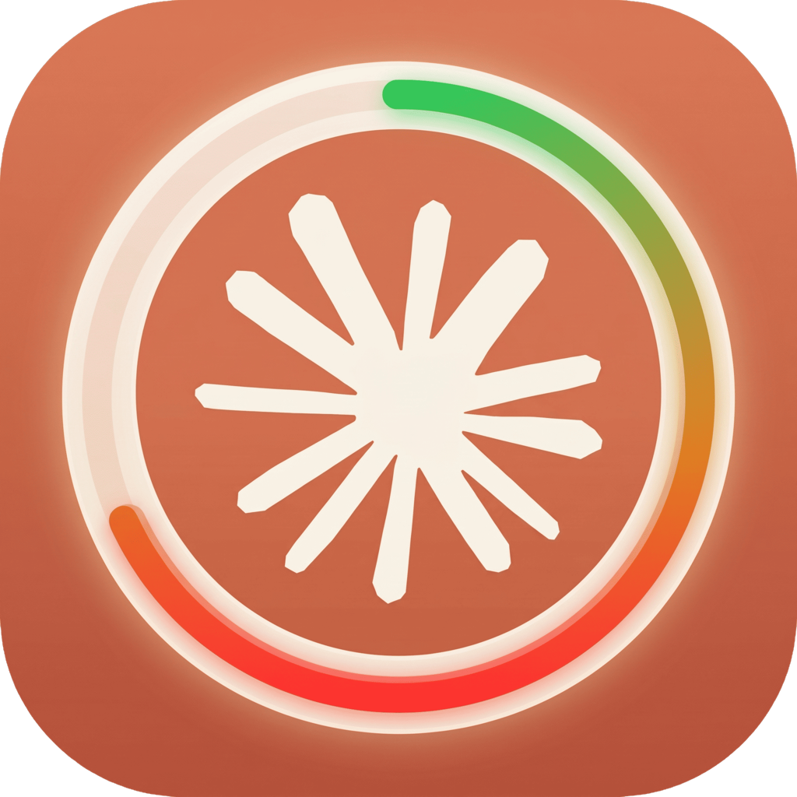
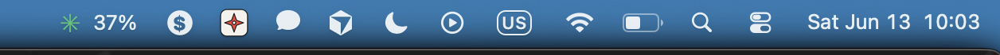
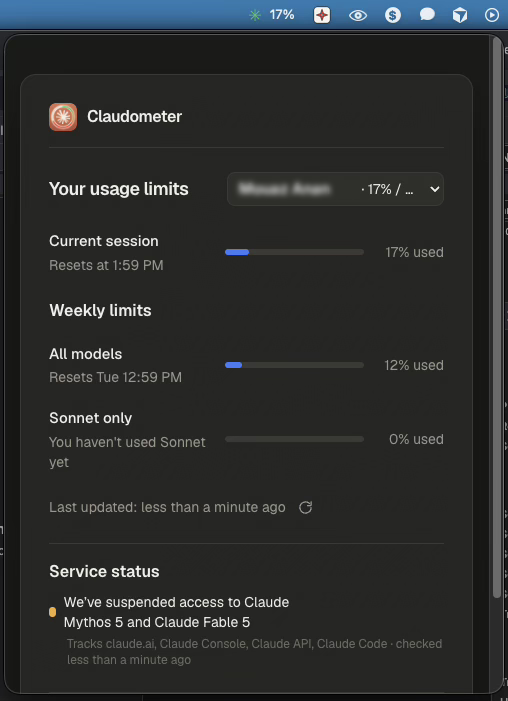

<p align="center">
  
</p>

<h1 align="center">Claudometer</h1>

<p align="center">
  Your Claude usage limits, live in the macOS menu bar —
  <br/>shown <b>exactly the way Claude shows them</b>.
</p>

<p align="center">
  <a href="https://ko-fi.com/ananmouaz"></a>
</p>

<p align="center">
  
</p>
<p align="center">
  
</p>

## Why Claudometer?

- **Familiar by design.** It mirrors Claude's own *Settings → Usage* screen — the same session / weekly / per-model bars you already know. Nothing new to learn.
- **At a glance.** **Both accounts sit right in your menu bar** — `C 42%  G 100%` — each number coloured on its own (green → amber → red as you approach the cap), so you stay mindful without clicking.
- **Service status built in.** Live **Claude service status** pulled straight from [status.claude.com](https://status.claude.com) — incidents and degraded components included.
- **ChatGPT too.** A second tab mirrors ChatGPT's own *Settings → Usage* screen — same `% remaining` bars, same reset times, plus OpenAI's service status. If you use the [Codex CLI](https://github.com/openai/codex) there's **nothing to set up**: it reuses the login Codex already stores locally.
- **One-click Claude sign-in.** Sign in to Claude inside the app and it captures the session itself — no DevTools, no copying a Cookie header. Manual paste is still there if you'd rather.
- **Private.** Your session cookie stays on your machine. There's no backend, no account, no telemetry.

## Install

1. From [Releases](../../releases), download the DMG for your Mac — `…-arm64.dmg` for **Apple Silicon** (M-series) or `…-x64.dmg` for **Intel**. *(Apple menu → About This Mac to check.)*
2. Open the DMG and drag **Claudometer** to **/Applications**, then launch it. It lives in your menu bar (no dock icon).
3. Click the menu-bar readout → **Sign in to Claude**. The app opens claude.ai, you log in once, and it captures the session itself. (Prefer to paste a cookie by hand? "Paste a cookie manually instead" is right below, with live ✓/✗ checks.) The ChatGPT tab needs nothing if you have the Codex CLI.

> **Unsigned build.** macOS blocks the first launch (*"Apple could not verify…"*). To open it, either:
> - go to **System Settings → Privacy & Security**, then click **"Open Anyway"** (it appears right after you try to open the app), then reopen it — **or**
> - run once in Terminal: `xattr -dr com.apple.quarantine "/Applications/Claudometer.app"`
>
> *(On macOS 14 and earlier you could right-click → Open; that no longer works on macOS 15+.)*

## How it works

Claudometer reads the **same usage API the Claude website uses**, signed in as you.

claude.ai sits behind Cloudflare, which rejects requests that don't come from a real browser — it checks the client's TLS/HTTP2 fingerprint, so no combination of cookies and headers gets a plain server request through. So Claudometer doesn't try: you sign in to claude.ai **inside the app**, and the usage calls are then made from that same Chromium session, same-origin, exactly as the website makes them. Nothing is copied, pasted, or stored — the session stays in the app's own cookie jar.

```
in-app sign-in ─▶ hidden claude.ai window ─▶ /api/organizations/{org}/usage  (session / weekly / per-model)
                                          └▶ status.claude.com               (service status)
```

The window that does this is loopback-only, requires a per-run token, and can only reach `/api/…` paths on claude.ai.

> **Browser preview caveat.** `npm run dev` has no Chromium session to borrow, so the Claude tab there falls back to forwarding a pasted cookie — which Cloudflare will usually block. The Claude tab is really a menu-bar-app feature. The ChatGPT tab works in both.

For ChatGPT it's simpler — that endpoint isn't behind Cloudflare, so a bearer token is all it needs and there's no cookie to paste. The app reads the OAuth token the Codex CLI already keeps in `~/.codex/auth.json` (run `codex login` if you haven't). No Codex CLI? Paste an access token from chatgpt.com instead.

```
~/.codex/auth.json ─▶ local relay ─▶ chatgpt.com /backend-api/wham/usage  (5-hour / weekly / per-model)
                                  └▶ status.openai.com                     (service status)
```

**What that quota covers:** OpenAI shares it across Codex, Work, Workspace Agents and ChatGPT for Excel — it does **not** include plain Chat conversations, which OpenAI publishes no usage figures for at all. The card says so, same as ChatGPT's own screen does.

## Build from source

```bash
npm install
npm run dev      # preview in a browser at http://localhost:3000
npm run dist     # build Claudometer.app (host arch) into ./release
npm run release  # build arm64 + x64 DMGs and publish a GitHub release (maintainers)
```

Built with Next.js + Electron.

## Privacy

No credential ever leaves your machine, and the app doesn't ask you to handle one. Your Claude session lives in the app's own cookie jar, the same way a browser holds it — Claudometer reads your usage through it and never copies it anywhere. The ChatGPT token is read from the Codex CLI's own `~/.codex/auth.json` and sent only to `chatgpt.com`. Nothing is persisted on a server, there's no telemetry, and the identity fields ChatGPT returns (email, account id) are dropped rather than shown. The code is open — verify it yourself.

## Support

If Claudometer is useful to you, buy me a coffee ☕

<p align="center">
  <a href="https://ko-fi.com/ananmouaz"></a>
</p>

---

<sub>Not affiliated with or endorsed by Anthropic. "Claude" is a trademark of Anthropic. · MIT License</sub>
